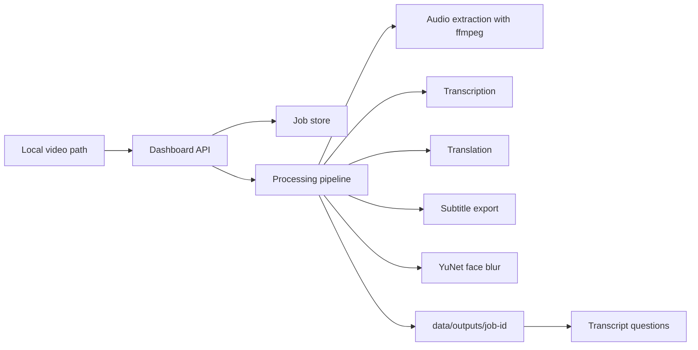

# Face Blur YuNet

A local-first video processing dashboard for people who need to review client videos, protect identities, and turn spoken Hebrew or English into useful text.

The project started as a small OpenCV YuNet face blurring script. It now includes a private local dashboard that can transcribe videos, translate transcripts, export subtitles, answer questions from the transcript, and optionally create a face-blurred video.

## Why This Exists

Many client videos contain sensitive faces, private conversations, or business details. This tool is designed so the video can stay on your own computer while you process it.

- No cloud account is required for the core workflow.
- Client videos and generated outputs are ignored by git.
- The dashboard runs locally at `http://127.0.0.1:8000`.
- You choose per job whether to translate, export subtitles, or blur faces.

## Features

- Local web dashboard for video jobs.
- Hebrew and English transcription with `faster-whisper` when installed.
- Hebrew to English and English to Hebrew translation with `argostranslate` when installed.
- Transcript and SRT subtitle exports.
- Transcript-grounded question answering.
- Optional face blurring with OpenCV YuNet.
- Original source video copied into each job output folder.
- Processing report for each job.
- Existing command-line face blur script still works.

## What It Produces

Each dashboard job writes files under:

```text
data/outputs/job-<id>/
```

Typical outputs include:

```text
video.original.mp4
video.face-blurred.mp4
transcript.en.txt
transcript.he.txt
subtitles.en.srt
subtitles.he.srt
transcript-index.json
processing-report.json
```

The exact files depend on the options selected for the job.

## Quick Start

### 1. Install system requirements

You need:

- Python 3.9+
- `ffmpeg` available on your `PATH`

On macOS with Homebrew:

```bash
brew install ffmpeg
```

### 2. Create a virtual environment

```bash
python3 -m venv .venv
source .venv/bin/activate
pip install -r requirements.txt
```

### 3. Add optional local AI backends

For local transcription:

```bash
pip install faster-whisper
```

For local translation:

```bash
pip install argostranslate
```

Argos also needs Hebrew and English language packages installed locally before translation will work.

### 4. Run the dashboard

```bash
python3 -m uvicorn face_blur_yunet.app:create_default_app --factory --reload
```

Open:

```text
http://127.0.0.1:8000
```

## Dashboard Workflow

1. Paste a local video path.
2. Choose the source language, or use auto detect.
3. Choose whether to translate the transcript.
4. Choose whether to export subtitles.
5. Choose whether to blur faces.
6. Create the job.
7. Run processing.
8. Review output paths and ask questions about the transcript.

If your video path includes wrapping quotes, the dashboard strips them automatically.

## Command-Line Face Blur

The original CLI still works:

```bash
python blur_faces.py input.mp4 output_blurred.mp4
```

The YuNet ONNX model is downloaded automatically on first run into `models/`.

For stricter detection:

```bash
python blur_faces.py input.mp4 output_blurred.mp4 --score-threshold 0.85
```

For more sensitive detection:

```bash
python blur_faces.py input.mp4 output_blurred.mp4 --score-threshold 0.6
```

Useful options:

```bash
python blur_faces.py input.mp4 output_blurred.mp4 \
  --blur-strength 41 \
  --face-padding 0.15
```

Lower thresholds may catch more side faces or small faces, but can also blur non-face areas.

## Architecture



Main modules:

- `face_blur_yunet/app.py` - FastAPI dashboard API and static web app.
- `face_blur_yunet/pipeline.py` - job processing orchestration.
- `face_blur_yunet/transcription.py` - transcription adapters.
- `face_blur_yunet/translation.py` - translation adapters.
- `face_blur_yunet/face_blur.py` - YuNet face blur engine.
- `face_blur_yunet/question_answering.py` - transcript-grounded answers.

## Privacy Notes

This project is intended for local processing. Keep it bound to `127.0.0.1` unless you add authentication and understand the security risk.

The repository ignores:

- `data/`
- `outputs/`
- `work/`
- `models/`
- local SQLite files
- common video formats

Always review generated videos before sharing them. Automatic face detection can miss faces, especially if they are tiny, heavily rotated, covered, or motion blurred.

## Development

Run tests:

```bash
pytest
```

Check the dashboard JavaScript:

```bash
node --check face_blur_yunet/static/app.js
```

## Roadmap

See [docs/project-notes-and-roadmap.md](docs/project-notes-and-roadmap.md) for known limits and recommended improvements.

High-value next steps:

- Background job worker and progress updates.
- Job history page.
- Direct output file downloads.
- Local authentication before using the dashboard beyond localhost.
- Better question answering with embeddings or a local LLM.
- Speaker diarization.
- Subtitle burn-in.
- Install scripts or Docker setup for Mac and Windows.

## Model Credits

This project uses OpenCV's YuNet face detector:

- [OpenCV Zoo YuNet model](https://github.com/opencv/opencv_zoo/tree/main/models/face_detection_yunet)
- [OpenCV FaceDetectorYN docs](https://docs.opencv.org/4.x/d0/dd4/tutorial_dnn_face.html)

## License

See [LICENSE](LICENSE).
